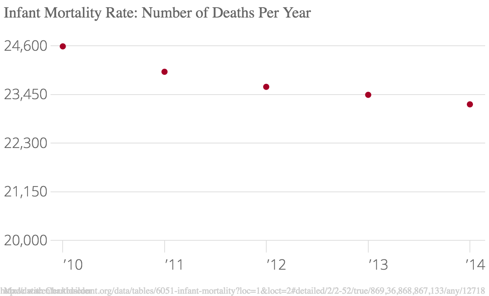

In the U.S. in 2014, the number of babies who passed away decreased by about 200. However, based on a comparision of 5 years worth of data, this number has consistently hovered around 23-24,000 per year. 
However, in 2017, which is not shown by this chart, the infant mortality rate decreased by 15%. The biggest drop — 29 percent — is for deaths from sudden infant death syndrome, also known as SIDS, the team at the National Center for Health Statistics found.

